# 🚀 Cloud-Native DevOps Platform on AWS

<p align="center">


</p>

<p align="center">


</p>

---

<p align="center">

</p>

<h2 align="center">
Infrastructure as Code • CI/CD • Kubernetes • Observability
</h2>

<p align="center">
A production-style cloud-native DevOps platform that provisions infrastructure with Terraform, configures servers using Ansible, deploys applications through Jenkins and Helm, and implements a complete observability stack with Prometheus, Grafana, Fluent Bit, Elasticsearch, Kibana, OpenTelemetry, and Jaeger.
</p>

---

# 📑 Table of Contents

- [Project Overview](#-project-overview)
- [Project Highlights](#-project-highlights)
- [Why This Project?](#-why-this-project)
- [Architecture](#-architecture)
- [CI/CD Workflow](#-cicd-workflow)
- [Key Features](#-key-features)
- [Technology Stack](#-technology-stack)
- [Repository Structure](#-repository-structure)
- [Infrastructure Overview](#-infrastructure-overview)
- [Kubernetes Architecture](#-kubernetes-architecture)
- [Jenkins Pipeline](#-jenkins-pipeline)
- [Jenkins Configuration](#-jenkins-configuration)
- [Monitoring](#-monitoring)
- [Centralized Logging](#-centralized-logging)
- [Distributed Tracing](#-distributed-tracing)
- [Deployment Guide](#-deployment-guide)
- [Project Screenshots](#-project-screenshots)
- [Troubleshooting](#-troubleshooting)
- [Learning Outcomes](#-learning-outcomes)
- [Future Improvements](#-future-improvements)
- [Author](#-author)
- [License](#-license)

---

# 📦 Repository

## Source Code

- **GitHub:** https://github.com/NavneetSinghGour/cloud-native-devops-platform

## Container Image

- **Docker Hub:** https://hub.docker.com/r/navneet2004/devops-dashboard

---

# 📊 Project Statistics

| Category | Details |
|----------|----------|
| Cloud Provider | AWS |
| Infrastructure Tool | Terraform |
| Configuration Tool | Ansible |
| CI/CD Tool | Jenkins |
| Container Runtime | Docker |
| Orchestration | Kubernetes (kubeadm) |
| Package Manager | Helm |
| Monitoring | Prometheus & Grafana |
| Logging | Fluent Bit, Elasticsearch & Kibana |
| Tracing | OpenTelemetry & Jaeger |
| Programming Language | Go |
| Container Registry | Docker Hub |
| Source Control | Git & GitHub |

---

# 📖 Project Overview

Modern cloud-native applications require much more than simply deploying containers. A production-ready platform needs automated infrastructure provisioning, repeatable server configuration, continuous integration and deployment, container orchestration, monitoring, centralized logging, and distributed tracing.

This project demonstrates how these technologies work together to build a production-style DevOps platform on AWS.

The infrastructure is provisioned using **Terraform**, configured with **Ansible**, deployed through **Jenkins**, orchestrated by **Kubernetes**, packaged using **Helm**, and monitored using a complete observability stack consisting of **Prometheus**, **Grafana**, **Fluent Bit**, **Elasticsearch**, **Kibana**, **OpenTelemetry**, and **Jaeger**.

The goal of this repository is to demonstrate an end-to-end DevOps workflow that closely resembles real-world deployment practices.

---

# 🛠 Tech Stack

| Category | Technologies |
|----------|--------------|
| Cloud | AWS (EC2, VPC, IAM, Security Groups) |
| Infrastructure as Code | Terraform |
| Configuration Management | Ansible |
| CI/CD | Jenkins, GitHub Webhooks |
| Containerization | Docker |
| Container Registry | Docker Hub |
| Container Orchestration | Kubernetes, Helm |
| Monitoring | Prometheus, Grafana |
| Logging | Fluent Bit, Elasticsearch, Kibana |
| Tracing | OpenTelemetry, Jaeger |
| Application | Go (Golang) |


# 🚀 Project Highlights

✔ Infrastructure provisioned automatically using Terraform

✔ Server configuration managed with Ansible

✔ Automated Jenkins CI/CD pipeline with Helm-based Kubernetes deployments

✔ Containerized Go web application deployed on Kubernetes

✔ Kubernetes cluster provisioned using kubeadm

✔ Helm-based deployments

✔ NGINX Ingress Controller

✔ Prometheus metrics collection

✔ Grafana dashboards

✔ Centralized logging using Fluent Bit + Elasticsearch + Kibana

✔ Distributed tracing with OpenTelemetry + Jaeger

✔ Automated rolling updates through Jenkins

✔ Infrastructure completely managed as code

---

# 🎯 Project Goals

This project was built to demonstrate how modern DevOps practices can be combined into a complete, production-style platform on AWS. Rather than showcasing individual tools in isolation, it integrates Infrastructure as Code, Configuration Management, CI/CD, Kubernetes, and Observability into a single automated workflow.

The primary goals of this project are:

- Provision cloud infrastructure using Terraform
- Configure servers consistently with Ansible
- Automate application delivery using Jenkins
- Deploy applications on Kubernetes using Helm
- Implement monitoring with Prometheus and Grafana
- Centralize logs using Fluent Bit, Elasticsearch, and Kibana
- Enable distributed tracing using OpenTelemetry and Jaeger
- Demonstrate production-ready DevOps workflows and best practices

---


# 🎯 Why This Project?

Learning individual DevOps tools is useful, but real-world environments require these tools to work together as a single automated platform.

This project was created to demonstrate practical implementation of:

- Infrastructure as Code (IaC)
- Configuration Management
- Continuous Integration
- Continuous Deployment
- Kubernetes Administration
- Container Orchestration
- Monitoring
- Logging
- Distributed Tracing
- Production-style Deployment Automation

Rather than focusing on isolated technologies, this repository demonstrates how the complete DevOps lifecycle is implemented from infrastructure provisioning to application observability.

---

# 🏗 Architecture

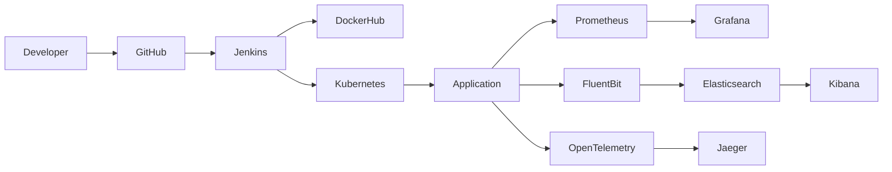

The overall workflow is illustrated below.

```text
Developer
    │
    ▼
GitHub Repository
    │
    ▼
GitHub Webhook
    │
    ▼
Jenkins Pipeline
    │
    ├── Checkout Source
    ├── Build Go Application
    ├── Build Docker Image
    ├── Trivy Security Scan
    ├── Push Image to Docker Hub
    └── Helm Upgrade
              │
              ▼
      Kubernetes Cluster
              │
              ▼
      Go Web Application
```


---

## Request Flow

```text
User Request
      │
      ▼
NGINX Ingress
      │
      ▼
Kubernetes Service
      │
      ▼
Application Pod
```

---

## Observability Flow

```text
Application
     │
     ├──────────────► Prometheus
     │                    │
     │                    ▼
     │                Grafana
     │
     ├──────────────► Fluent Bit
     │                    │
     │                    ▼
     │              Elasticsearch
     │                    │
     │                    ▼
     │                 Kibana
     │
     └──────────────► OpenTelemetry
                          │
                          ▼
                       Jaeger
```

---

# 🔁 Project Workflow

The complete deployment lifecycle follows the sequence below:

```text
Developer
      │
      ▼
GitHub Repository
      │
      ▼
GitHub Webhook
      │
      ▼
Jenkins Pipeline
      │
      ├── Build Application
      ├── Build Docker Image
      ├── Trivy Security Scan
      ├── Push Image to Docker Hub
      └── Helm Deployment
               │
               ▼
        Kubernetes Cluster
               │
               ▼
        Running Application
               │
      ┌────────┼────────┐
      ▼        ▼        ▼
 Prometheus  Fluent Bit  OpenTelemetry
      │        │              │
      ▼        ▼              ▼
 Grafana Elasticsearch     Jaeger
               │
               ▼
            Kibana
```

This workflow demonstrates how infrastructure provisioning, application deployment, monitoring, logging, and distributed tracing integrate into a single automated DevOps platform.

---

# 🔄 CI/CD Workflow

Every code push automatically triggers the deployment pipeline.

The pipeline performs the following operations:

1. GitHub Webhook triggers Jenkins.
2. Jenkins checks out the latest source code.
3. The Go application is compiled.
4. A Docker image is built.
5. Trivy scans the image for vulnerabilities.
6. The image is pushed to Docker Hub.
7. Helm performs a rolling update on Kubernetes.
8. Prometheus automatically begins scraping metrics.
9. Fluent Bit forwards application logs to Elasticsearch.
10. OpenTelemetry exports traces to Jaeger.

This workflow enables fully automated deployments with integrated observability and minimal manual intervention.

---

# ✨ Key Features

This project combines multiple DevOps technologies into a single automated platform that closely resembles a production environment.

## ☁️ Infrastructure as Code

Infrastructure provisioning is fully automated using **Terraform**.

Features include:

- Modular Terraform configuration
- EC2 instance provisioning
- Security Group creation
- Networking automation
- Reusable variables and outputs

---

## ⚙️ Configuration Management

Server provisioning is automated using **Ansible**.

The playbooks install and configure:

- Docker
- Kubernetes (kubeadm)
- Helm
- Jenkins
- NGINX Ingress Controller
- Local Path Provisioner
- Prometheus
- Grafana
- Elasticsearch
- Kibana
- Fluent Bit
- OpenTelemetry Collector
- Jaeger

No manual server setup is required after provisioning.

---

## 🚀 CI/CD Automation

The Jenkins pipeline performs:

- Source code checkout
- Go application build
- Docker image creation
- Trivy security scan
- Docker Hub image push
- Helm deployment
- Rolling updates on Kubernetes

---

## ☸️ Kubernetes Deployment

The application is deployed using **Helm**.

Resources managed by Helm include:

- Deployment
- Service
- Ingress
- ConfigMaps
- ServiceMonitor

The application is exposed through the NGINX Ingress Controller.

---

## 📊 Complete Observability

The platform provides complete visibility into application health.

### Monitoring

- Prometheus
- Grafana
- ServiceMonitor

### Centralized Logging

- Fluent Bit
- Elasticsearch
- Kibana

### Distributed Tracing

- OpenTelemetry Collector
- Jaeger

---


# 📂 Repository Structure

```text
cloud-native-devops-platform/
│
├── ansible/
│   ├── inventory/
│   ├── playbooks/
│   └── roles/
│
├── terraform/
│   ├── main.tf
│   ├── provider.tf
│   ├── variables.tf
│   ├── outputs.tf
│   └── terraform.tfvars
│
├── helm/
│   ├── templates/
│   ├── values.yaml
│   └── Chart.yaml
│
├── cmd/
├── internal/
│
├── docs/
│   ├── diagrams/
│   └── images/
│
├── Dockerfile
├── Jenkinsfile
└── README.md
```

---

# ☁️ Infrastructure Overview

The platform is deployed on AWS using multiple EC2 instances.

| Server | Purpose |
|----------|----------|
| Management Server | Terraform, Ansible, kubectl, Helm |
| Jenkins Server | CI/CD Pipeline |
| Kubernetes Control Plane | Cluster Management |
| Kubernetes Worker 1 | Application Workloads |
| Kubernetes Worker 2 | Application Workloads |

---

## AWS Environment

| Resource | Value |
|----------|-------|
| Region | ap-south-1 |
| Instance Type | c7i-flex.large |
| Root Volume | 30 GB gp3 |
| Kubernetes Version | v1.34.10 |

---

# ☸️ Kubernetes Architecture

The Kubernetes cluster consists of:

- 1 Control Plane Node
- 2 Worker Nodes

The following workloads are deployed inside the cluster:

- NGINX Ingress Controller
- Local Path Provisioner
- Prometheus
- Grafana
- Alertmanager
- Elasticsearch
- Kibana
- Fluent Bit
- OpenTelemetry Collector
- Jaeger
- Go Web Application

Application deployment is fully managed through Helm, enabling repeatable and version-controlled releases.

---

# ⚙️ Jenkins Pipeline

The Jenkins pipeline automates the complete software delivery lifecycle, from source code checkout to Kubernetes deployment.

## Pipeline Workflow

```text
GitHub Push
      │
      ▼
GitHub Webhook
      │
      ▼
Jenkins Pipeline
      │
      ├── Checkout Repository
      ├── Build Go Application
      ├── Build Docker Image
      ├── Trivy Image Scan
      ├── Push Image to Docker Hub
      └── Helm Upgrade
               │
               ▼
        Kubernetes Cluster
```

---

## Pipeline Stages

| Stage | Description |
|--------|-------------|
| Checkout | Clone the latest source code |
| Build | Compile the Go application |
| Docker Build | Build the application image |
| Trivy Scan | Scan the Docker image for vulnerabilities |
| Docker Push | Push the image to Docker Hub |
| Helm Deploy | Upgrade or install the application on Kubernetes |

---

## Deployment Command

The application is deployed using Helm.

```bash
helm upgrade --install ${HELM_RELEASE} ./helm \
  --namespace ${K8S_NAMESPACE} \
  --create-namespace \
  --set image.repository=${DOCKERHUB_USERNAME}/${IMAGE_NAME} \
  --set image.tag=${BUILD_NUMBER}
```

---

# 🔌 Jenkins Plugins

The following plugins are required for this project.

| Plugin | Purpose |
|----------|----------|
| Git | Source Code Management |
| GitHub | Webhook Integration |
| Pipeline | CI/CD Pipeline |
| Docker | Docker Integration |
| Docker Pipeline | Docker Pipeline Support |
| Credentials | Secure Credentials |
| Credentials Binding | Secret Injection |
| SSH Agent | Remote Authentication |
| Kubernetes CLI | Kubernetes Commands |
| Config File Provider | Configuration Management |
| Workspace Cleanup | Cleanup Builds |
| ANSI Color | Colored Console Output |

---

# 📝 Jenkins Configuration

Before executing the pipeline, configure Jenkins as follows.

## 1. Install Plugins

Install all plugins listed above.

---

## 2. Configure Docker Hub Credentials

Create credentials of type:

```text
Username with password
```

Store:

- Docker Hub Username
- Docker Hub Access Token

---

## 3. Configure GitHub Webhook

Webhook URL

```text
http://<JENKINS_PUBLIC_IP>:8080/github-webhook/
```

Content Type

```text
application/json
```

Events

```text
Push Events
```

---

## 4. Create Pipeline Job

Configure:

- Git Repository
- Branch
- Jenkinsfile

Run the pipeline.

---

# 📊 Monitoring

Monitoring is implemented using the **kube-prometheus-stack**.

Prometheus automatically discovers application metrics using a **ServiceMonitor**, while Grafana visualizes those metrics through dashboards.

---

## Monitoring Components

| Component | Purpose |
|-----------|----------|
| Prometheus | Metrics Collection |
| Grafana | Dashboard Visualization |
| ServiceMonitor | Automatic Service Discovery |

---

## Metrics Flow

```text
Application
      │
      ▼
/metrics
      │
      ▼
ServiceMonitor
      │
      ▼
Prometheus
      │
      ▼
Grafana
```

---

## ServiceMonitor

Helm automatically creates a ServiceMonitor for the application.

Example configuration:

```yaml
serviceMonitor:
  enabled: true
  interval: 15s
  scrapeTimeout: 10s
```

---

# 📜 Centralized Logging

Logs from Kubernetes workloads are collected using **Fluent Bit**, stored in **Elasticsearch**, and visualized through **Kibana**.

---

## Logging Components

| Component | Purpose |
|-----------|----------|
| Fluent Bit | Collect Logs |
| Elasticsearch | Store Logs |
| Kibana | Search & Visualize Logs |

---

## Logging Flow

```text
Pods
 │
 ▼
Fluent Bit
 │
 ▼
Elasticsearch
 │
 ▼
Kibana
```

---

# 🔍 Distributed Tracing

Distributed tracing is implemented using **OpenTelemetry Collector** and **Jaeger**.

This enables end-to-end request tracing and simplifies troubleshooting of application behavior.

---

## Tracing Components

| Component | Purpose |
|-----------|----------|
| OpenTelemetry Collector | Collect Traces |
| Jaeger | Visualize Traces |

---

## Tracing Flow

```text
Application
      │
      ▼
OpenTelemetry SDK
      │
      ▼
OTel Collector
      │
      ▼
Jaeger
```

---

# 🚀 Deployment Guide

## Prerequisites

Before deploying this project, ensure the following tools are installed:

| Tool | Version |
|------|---------|
| Terraform | Latest Stable |
| Ansible | Latest Stable |
| Docker | Latest Stable |
| Kubernetes | v1.34.10 |
| Helm | v3+ |
| Git | Latest Stable |
| Jenkins | Latest LTS |

---

## Deployment Workflow

Follow the steps below to deploy the complete platform.

### Step 1 – Clone the Repository

```bash
git clone https://github.com/NavneetSinghGour/cloud-native-devops-platform.git

cd cloud-native-devops-platform
```

---

### Step 2 – Provision AWS Infrastructure

```bash
cd terraform

terraform init

terraform plan

terraform apply
```

Terraform provisions:

- Management Server
- Jenkins Server
- Kubernetes Control Plane
- Kubernetes Worker Nodes
- Networking and Security Groups

---

### Step 3 – Configure Servers

Run the Ansible playbooks from the Management Server.

```bash
cd ansible

ansible-playbook playbooks/site.yml
```

This installs and configures:

- Docker
- Kubernetes
- Helm
- Jenkins
- NGINX Ingress
- Local Path Provisioner
- Monitoring Stack
- Logging Stack
- Tracing Stack

---

### Step 4 – Configure Jenkins

Create a Pipeline job and configure:

- GitHub Repository
- Jenkinsfile
- Docker Hub Credentials
- GitHub Webhook

Trigger the pipeline with a Git push.

---

### Step 5 – Deploy the Application

The Jenkins pipeline automatically:

- Builds the Go application
- Builds the Docker image
- Scans the image with Trivy
- Pushes the image to Docker Hub
- Deploys the latest version using Helm

---

### Step 6 – Verify the Deployment

Verify the application:

```bash
kubectl get pods -A

kubectl get svc -A

kubectl get ingress -A
```

---

# 🌐 Accessing the Application

| Component | Access |
|----------|--------|
| Application | `http://<NODE_PUBLIC_IP>:30080` |
| Jenkins | `http://<JENKINS_PUBLIC_IP>:8080` |
| Grafana | `http://<NODE_PUBLIC_IP>:30001` *(or your configured endpoint)* |
| Prometheus | `http://<NODE_PUBLIC_IP>:30090` *(or your configured endpoint)* |
| Kibana | `http://<NODE_PUBLIC_IP>:30002` *(or your configured endpoint)* |
| Jaeger | `http://<NODE_PUBLIC_IP>:30003` *(or your configured endpoint)* |

> **Note:** Replace the placeholders above with the actual endpoints configured in your environment if they differ.

---

# 📸 Project Screenshots

> Add screenshots to the `docs/images/` directory and update the file names below.

## AWS Infrastructure

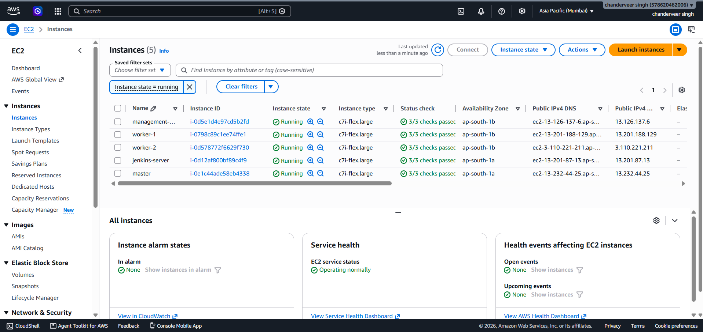

---

## Terraform Apply

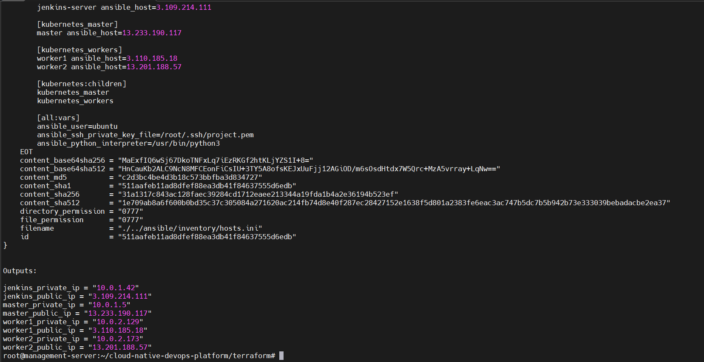

---

## Ansible Playbook Execution

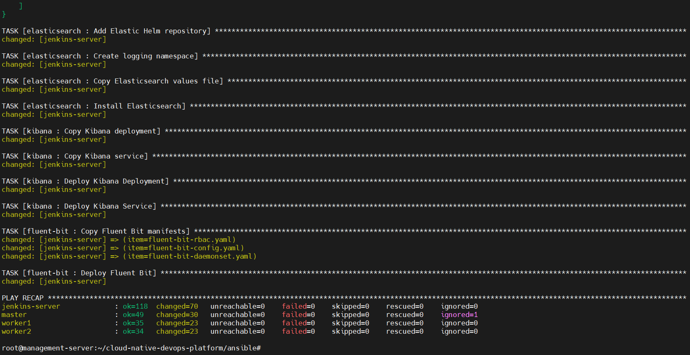

---

## Jenkins Pipeline

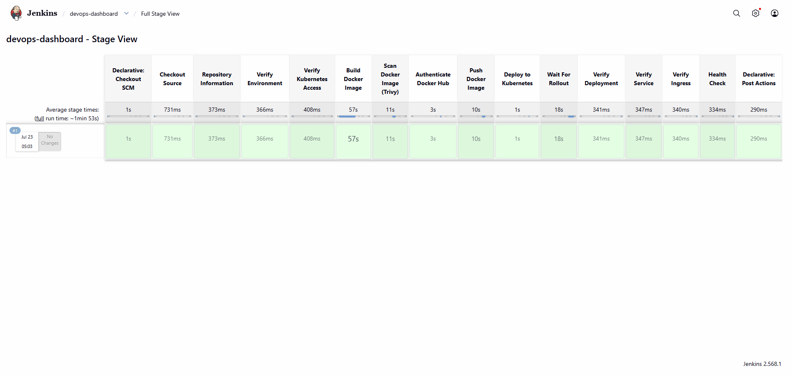

---

## Kubernetes Cluster

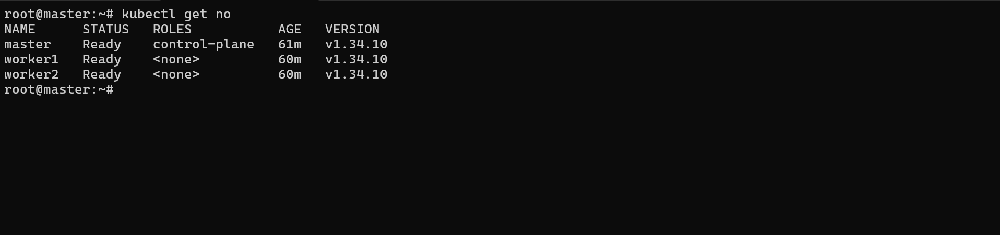

---

## Application Running

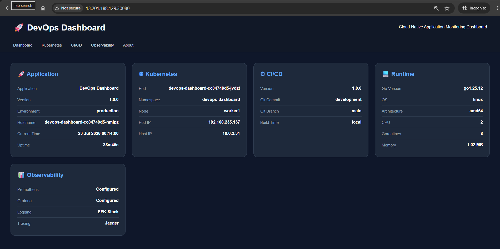

---

## Grafana Dashboard

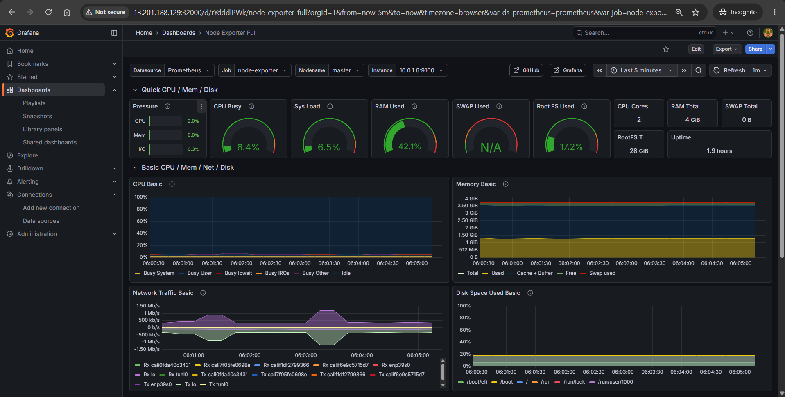

---

## Prometheus Targets

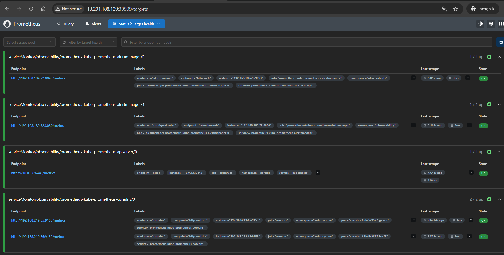

---

## Kibana Logs

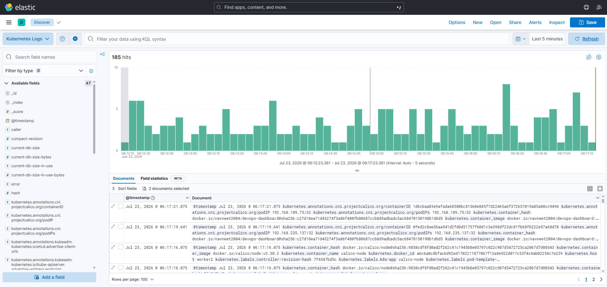

---

## Jaeger Traces

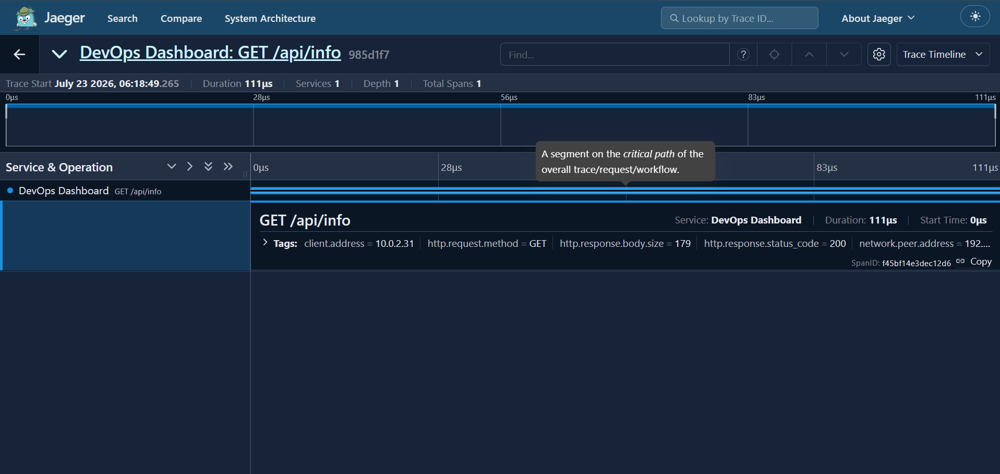

---

# 🛠 Troubleshooting

Below are some common issues you may encounter while deploying the platform.

| Issue | Solution |
|--------|----------|
| Terraform authentication failed | Verify your AWS credentials and region configuration. |
| Ansible SSH connection failed | Check the inventory file, SSH key, and security group rules. |
| Kubernetes nodes remain `NotReady` | Verify the container runtime, CNI installation, and kubelet status. |
| Jenkins pipeline failed | Review the Jenkins console output and verify credentials and plugins. |
| Docker image push failed | Ensure the Docker Hub access token and repository name are correct. |
| Helm deployment failed | Check Helm release status and inspect Kubernetes events. |
| Prometheus is not scraping metrics | Verify the `ServiceMonitor` configuration and Prometheus targets. |
| Kibana shows no logs | Confirm Fluent Bit is running and Elasticsearch is healthy. |
| Jaeger shows no traces | Verify the OpenTelemetry Collector configuration and exporter settings. |

---

# 🏆 Project Achievements

This project demonstrates practical experience with:

- ✅ Infrastructure as Code using Terraform
- ✅ Configuration Management with Ansible
- ✅ End-to-End CI/CD Pipeline using Jenkins
- ✅ Docker Image Build & Registry Management
- ✅ Kubernetes Cluster Administration
- ✅ Helm-based Application Deployments
- ✅ Kubernetes Ingress Configuration
- ✅ Production-style Monitoring & Alerting
- ✅ Centralized Logging using the EFK Stack
- ✅ Distributed Tracing with OpenTelemetry & Jaeger
- ✅ Secure Image Scanning using Trivy
- ✅ Automated Cloud Infrastructure on AWS

---

# 📚 Learning Outcomes

This project provided practical experience with the complete lifecycle of deploying and operating cloud-native applications.

Key areas covered include:

- Infrastructure provisioning using Terraform
- Configuration management with Ansible
- Building CI/CD pipelines using Jenkins
- Containerization with Docker
- Kubernetes cluster administration using kubeadm
- Application packaging and deployment with Helm
- Kubernetes networking using NGINX Ingress
- Monitoring using Prometheus and Grafana
- Centralized logging with Fluent Bit, Elasticsearch, and Kibana
- Distributed tracing using OpenTelemetry and Jaeger
- GitHub Webhook integration
- Secure credential management in Jenkins
- Production-style deployment automation on AWS

---

# 🚀 Future Improvements

Possible enhancements for this project include:

- Add GitOps deployment using Argo CD
- Integrate SonarQube for code quality analysis
- Add automated unit and integration testing
- Implement Horizontal Pod Autoscaler (HPA)
- Enable Cluster Autoscaler
- Add TLS using cert-manager and Let's Encrypt
- Integrate HashiCorp Vault for secret management
- Deploy on Amazon EKS
- Add multi-environment support (Development, Staging, Production)
- Build reusable Terraform modules for greater scalability

---

# 👨‍💻 Author

## Navneet Singh Gour

Cloud & DevOps Engineer passionate about Infrastructure as Code, Kubernetes, Cloud Automation, CI/CD, and Observability.

### Connect with me

- 💼 **LinkedIn:** https://www.linkedin.com/in/navneetsinghgour/
- 💻 **GitHub:** https://github.com/NavneetSinghGour

---

⭐ **If you found this project useful, consider giving it a Star!**

It motivates me to build and share more Cloud-Native DevOps projects.

---

# 📄 License

This project is licensed under the **MIT License**.

You are free to use, modify, and distribute this project in accordance with the terms of the license.

For more information, see the `LICENSE` file.

---

<p align="center">
  <b>Built with ❤️ using Terraform, Ansible, Jenkins, Docker, Kubernetes, Helm, Prometheus, Grafana, Elasticsearch, Kibana, Fluent Bit, OpenTelemetry, and Jaeger.</b>
</p>
