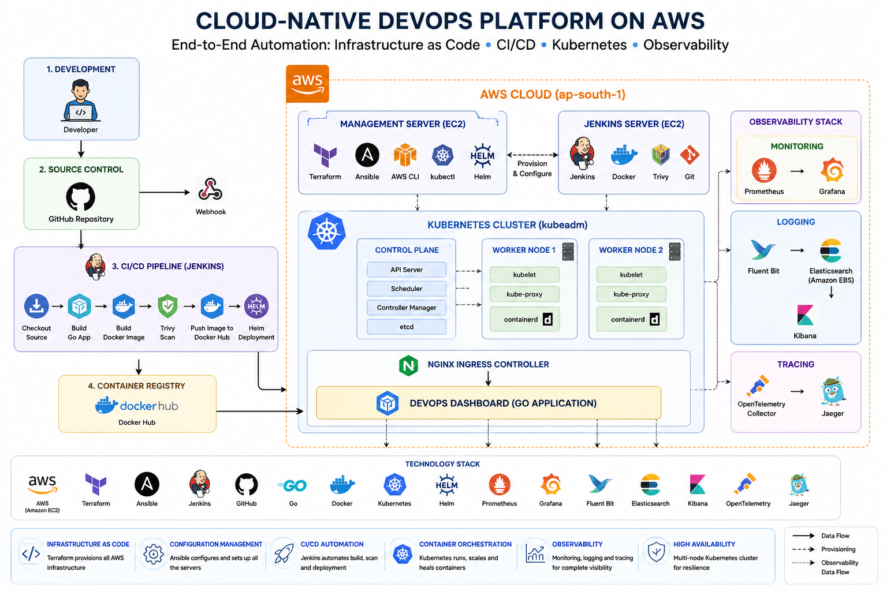

# 🚀 Cloud-Native DevOps Platform on AWS

---

## 📖 Project Overview

This project demonstrates a complete **Cloud-Native DevOps platform** built on **AWS** using Infrastructure as Code (Terraform), Configuration Management (Ansible), CI/CD Automation (Jenkins), Container Orchestration (Kubernetes), and a full Observability stack.

The platform automatically provisions AWS infrastructure, configures Kubernetes nodes, deploys a Go-based web application through Helm, and provides end-to-end monitoring, centralized logging, and distributed tracing.

The entire deployment follows DevOps best practices and represents a production-style workflow suitable for modern cloud-native applications.

---

# 🏗 Architecture

---

# ✨ Key Features

- 🚀 Infrastructure provisioning using Terraform
- ⚙️ Automated server configuration with Ansible
- ☸️ Multi-node Kubernetes Cluster (kubeadm)
- 🐳 Containerized Go Application
- 🔄 Jenkins CI/CD Pipeline
- 📦 Docker Hub Image Registry
- 🚢 Helm-based Kubernetes Deployment
- 🌐 NGINX Ingress Controller
- 📈 Prometheus Monitoring
- 📊 Grafana Dashboards
- 📝 Centralized Logging with Fluent Bit + Elasticsearch + Kibana
- 🔍 Distributed Tracing using OpenTelemetry + Jaeger
- ☁️ Hosted on AWS EC2
