# Executive Architecture

## Overview

This diagram represents the complete end-to-end DevOps workflow of the project.

The platform automates the entire software delivery lifecycle—from infrastructure provisioning to application deployment and observability.

---

## Architecture Diagram

```mermaid
flowchart LR

%% =========================
%% Developer
%% =========================

subgraph DEV["👨‍💻 Developer"]

A["Write Code"]

end

%% =========================
%% Source Control
%% =========================

subgraph SCM["📦 Source Control"]

B["GitHub Repository"]

end

%% =========================
%% CI/CD
%% =========================

subgraph CICD["⚙️ Jenkins CI/CD Pipeline"]

C["GitHub Webhook"]

D["Checkout Source"]

E["Build Go Application"]

F["Build Docker Image"]

G["Trivy Security Scan"]

H["Push Image to Docker Hub"]

I["Helm Upgrade"]

end

%% =========================
%% Kubernetes
%% =========================

subgraph K8S["☸️ Kubernetes Cluster"]

J["NGINX Ingress"]

K["DevOps Dashboard"]

end

%% =========================
%% Observability
%% =========================

subgraph OBS["📊 Observability Stack"]

L["Prometheus"]

M["Grafana"]

N["Fluent Bit"]

O["Elasticsearch
(Amazon EBS PVC)"]

P["Kibana"]

Q["OpenTelemetry Collector"]

R["Jaeger"]

end

%% =========================
%% Flow
%% =========================

A --> B

B --> C

C --> D

D --> E

E --> F

F --> G

G --> H

H --> I

I --> J

J --> K

K --> L

L --> M

K --> N

N --> O

O --> P

K --> Q

Q --> R
```

---

# Workflow Summary

The workflow begins when a developer pushes code to the GitHub repository.

A GitHub webhook automatically triggers the Jenkins pipeline.

Jenkins performs the following stages:

1. Checkout the latest source code.
2. Build the Go application.
3. Build the Docker image.
4. Perform a Trivy vulnerability scan.
5. Push the image to Docker Hub.
6. Deploy the latest release to Kubernetes using Helm.

The application is exposed through the NGINX Ingress Controller.

Once deployed, the observability stack becomes active:

- Prometheus scrapes application metrics.
- Grafana visualizes monitoring dashboards.
- Fluent Bit collects container logs.
- Elasticsearch stores logs using Amazon EBS persistent storage.
- Kibana provides centralized log analysis.
- OpenTelemetry Collector receives distributed traces.
- Jaeger visualizes end-to-end request traces.

---

# Technologies Used

| Category | Technology |
|-----------|------------|
| Source Control | GitHub |
| CI/CD | Jenkins |
| Security | Trivy |
| Container Registry | Docker Hub |
| Container Runtime | containerd |
| Orchestration | Kubernetes (kubeadm) |
| Ingress | NGINX Ingress Controller |
| Monitoring | Prometheus + Grafana |
| Logging | Fluent Bit + Elasticsearch + Kibana |
| Tracing | OpenTelemetry + Jaeger |
| Infrastructure | Terraform |
| Configuration Management | Ansible |
| Cloud Provider | AWS |
