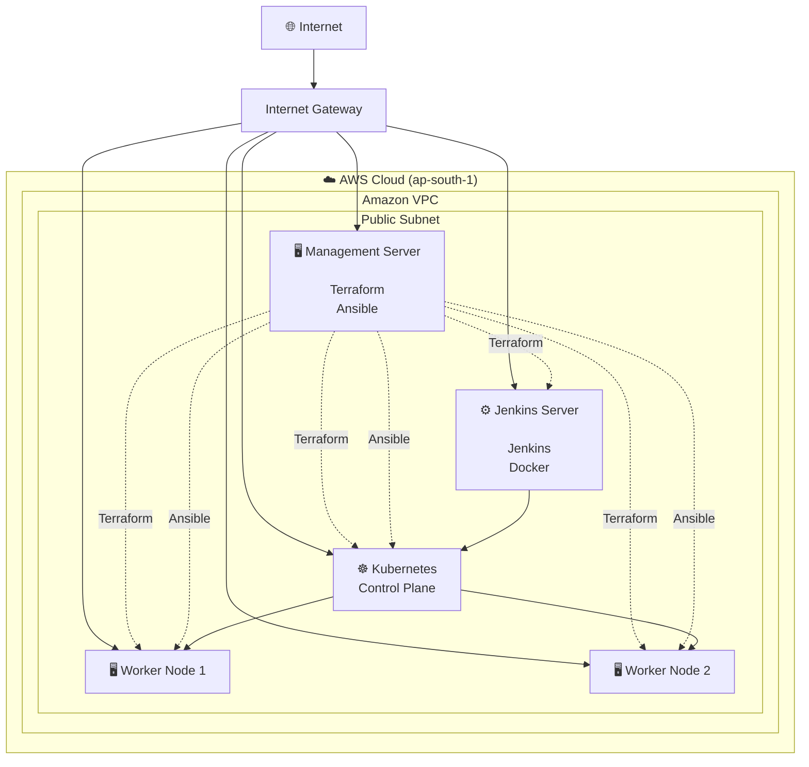

# AWS Infrastructure Architecture

## Overview

The infrastructure is provisioned using **Terraform** and configured using **Ansible**.

The environment consists of dedicated EC2 instances for infrastructure automation, CI/CD, and the Kubernetes cluster.

---

## AWS Infrastructure Diagram

---

# Infrastructure Components

## Management Server

Responsible for infrastructure provisioning and configuration.

Installed tools:

- Terraform
- Ansible
- AWS CLI
- kubectl
- Helm

Responsibilities:

- Provision AWS infrastructure
- Configure EC2 instances
- Bootstrap Kubernetes
- Deploy infrastructure changes

---

## Jenkins Server

Dedicated CI/CD server.

Responsibilities:

- Receive GitHub Webhooks
- Build Go application
- Build Docker image
- Run Trivy security scan
- Push image to Docker Hub
- Deploy to Kubernetes using Helm

---

## Kubernetes Control Plane

Responsible for:

- API Server
- Scheduler
- Controller Manager
- etcd
- Cluster management

---

## Worker Nodes

Responsible for running:

- DevOps Dashboard
- NGINX Ingress
- Prometheus
- Grafana
- Fluent Bit
- Elasticsearch
- Kibana
- OpenTelemetry Collector
- Jaeger

---

# Infrastructure Flow

1. Terraform provisions the AWS infrastructure.
2. Ansible installs and configures all required software.
3. Jenkins manages application deployment.
4. Kubernetes schedules workloads across worker nodes.
5. Users access the application through the NGINX Ingress Controller.
