# CI/CD Pipeline Architecture

## Overview

The CI/CD pipeline automates the complete software delivery lifecycle.

Every code push to GitHub automatically triggers Jenkins, which builds, secures, packages, and deploys the application to the Kubernetes cluster.

---

# Pipeline Workflow

```mermaid
flowchart LR

%% ===========================
%% DEVELOPMENT
%% ===========================

subgraph DEV["👨‍💻 Development"]

A["Developer"]

B["GitHub Repository"]

end

%% ===========================
%% AUTOMATION
%% ===========================

subgraph JENKINS["⚙️ Jenkins Pipeline"]

C["GitHub Webhook"]

D["Checkout Source Code"]

E["Download Dependencies"]

F["Build Go Application"]

G["Build Docker Image"]

H["Trivy Security Scan"]

I["Push Image to Docker Hub"]

J["Helm Upgrade"]

end

%% ===========================
%% REGISTRY
%% ===========================

subgraph REG["🐳 Container Registry"]

K["Docker Hub"]

end

%% ===========================
%% DEPLOYMENT
%% ===========================

subgraph K8S["☸️ Kubernetes"]

L["Kubernetes API"]

M["Helm Release"]

N["Deployment"]

O["ReplicaSet"]

P["Pods"]

end

%% ===========================
%% FLOW
%% ===========================

A --> B

B --> C

C --> D

D --> E

E --> F

F --> G

G --> H

H --> I

I --> K

K --> J

J --> L

L --> M

M --> N

N --> O

O --> P
```



---

# Pipeline Stages

## Stage 1 — Source Code

The developer pushes code to GitHub.

GitHub sends a webhook request to Jenkins.

---

## Stage 2 — Continuous Integration

Jenkins performs the following actions:

- Checkout repository
- Download Go dependencies
- Compile the application
- Build Docker image

---

## Stage 3 — Security Validation

The Docker image is scanned using Trivy.

The pipeline proceeds only after the scan completes successfully.

---

## Stage 4 — Image Publishing

The validated image is pushed to Docker Hub.

This image becomes the deployment artifact.

---

## Stage 5 — Continuous Deployment

Jenkins executes:

```bash
helm upgrade --install
```

Helm updates the Kubernetes Deployment.

Kubernetes creates a new ReplicaSet and performs a rolling update.

Users experience minimal or no downtime during deployment.

---

# Technologies Used

| Component | Purpose |
|-----------|---------|
| GitHub | Source Code Management |
| GitHub Webhook | Pipeline Trigger |
| Jenkins | CI/CD Automation |
| Go | Application Build |
| Docker | Containerization |
| Trivy | Container Security |
| Docker Hub | Image Registry |
| Helm | Kubernetes Package Manager |
| Kubernetes | Container Orchestration |

---

# Key Benefits

- Fully automated deployment
- Repeatable release process
- Integrated security scanning
- Versioned container images
- Zero manual deployment
- Kubernetes rolling updates
