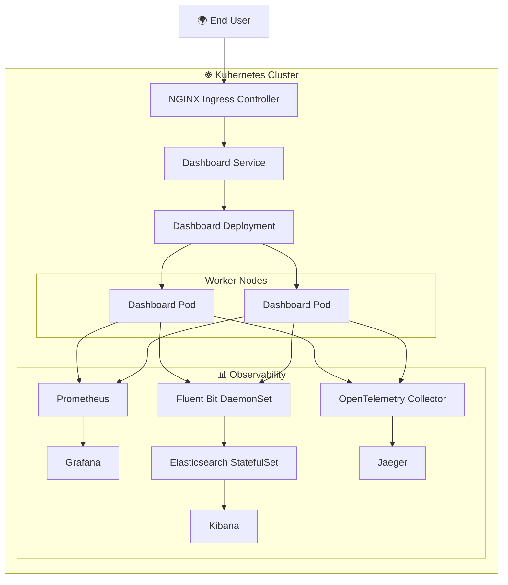

# Kubernetes Cluster Architecture

## Overview

The application is deployed on a Kubernetes cluster created using **kubeadm**.

The cluster consists of one control plane node and two worker nodes.

Traffic enters through the NGINX Ingress Controller and is routed to the DevOps Dashboard. The application integrates with the complete observability stack for monitoring, logging, and distributed tracing.

---

# Kubernetes Architecture

---

# Cluster Components

## Control Plane

Responsible for:

- Kubernetes API Server
- Scheduler
- Controller Manager
- etcd
- Cluster management

---

## Worker Nodes

Host all production workloads.

The worker nodes run:

- DevOps Dashboard
- NGINX Ingress Controller
- Prometheus
- Grafana
- Fluent Bit
- Elasticsearch
- Kibana
- OpenTelemetry Collector
- Jaeger

---

## Request Flow

1. User accesses the application.
2. Request reaches the NGINX Ingress Controller.
3. Ingress routes traffic to the Dashboard Service.
4. Service forwards traffic to the Dashboard Pods.
5. Dashboard responds to the client.
6. Metrics, logs, and traces are generated simultaneously.

---

# Platform Features

- High Availability using multiple replicas
- Service-based networking
- Ingress-based routing
- Rolling updates
- Cluster-wide log collection
- Centralized monitoring
- Distributed tracing
