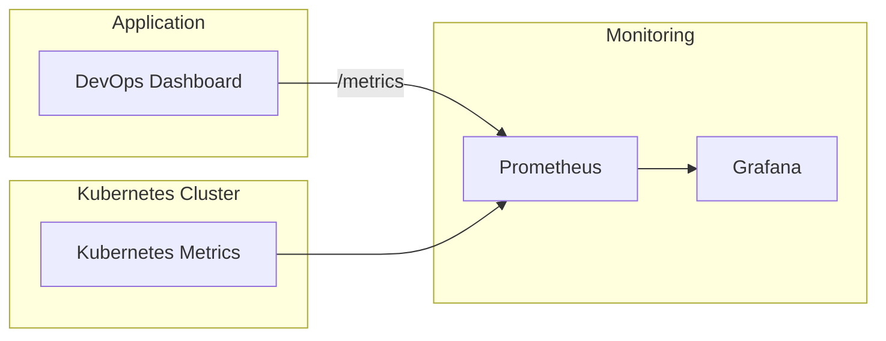

# Monitoring Architecture

## Overview

The monitoring stack provides real-time visibility into the health and performance of the DevOps Dashboard and Kubernetes cluster.

Prometheus continuously scrapes metrics exposed by the application and Kubernetes components, while Grafana visualizes those metrics using interactive dashboards.

---

# Monitoring Architecture

---

# Components

## DevOps Dashboard

The Go application exposes Prometheus-compatible metrics.

Examples include:

- HTTP Request Count
- Response Time
- Active Requests
- Application Health

---

## Prometheus

Responsibilities:

- Scrape application metrics
- Store time-series data
- Execute PromQL queries
- Generate alerts

---

## Grafana

Responsibilities:

- Visualize metrics
- Create dashboards
- Analyze application performance
- Display Kubernetes resource usage

---

# Monitoring Workflow

1. The application exposes metrics through the `/metrics` endpoint.
2. Prometheus scrapes metrics at regular intervals.
3. Metrics are stored as time-series data.
4. Grafana queries Prometheus.
5. Dashboards display real-time insights into application and cluster health.

---

# Benefits

- Real-time monitoring
- Historical metrics
- Performance analysis
- Capacity planning
- Operational visibility
