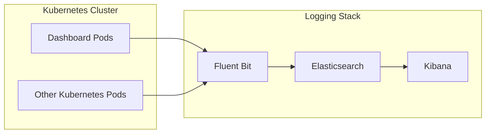

# Logging Architecture

## Overview

The logging stack centralizes logs generated by the DevOps Dashboard and Kubernetes workloads.

Fluent Bit collects logs from all nodes, forwards them to Elasticsearch for indexing and storage, and Kibana provides a web interface for searching, filtering, and visualizing logs.

---

# Logging Architecture

---

# Components

## Fluent Bit

Responsibilities:

- Collect container logs
- Parse log records
- Enrich logs with Kubernetes metadata
- Forward logs to Elasticsearch

Deployment Type:

- DaemonSet

---

## Elasticsearch

Responsibilities:

- Store centralized logs
- Index log data
- Enable fast searching
- Support log analytics

Deployment Type:

- StatefulSet

Storage:

- Persistent Volume using Amazon EBS

---

## Kibana

Responsibilities:

- Search logs
- Filter logs
- Visualize application events
- Troubleshoot production issues

---

# Logging Workflow

1. Applications generate logs.
2. Kubernetes stores logs on each worker node.
3. Fluent Bit collects logs from every node.
4. Fluent Bit forwards logs to Elasticsearch.
5. Elasticsearch indexes and stores log data.
6. Kibana queries Elasticsearch to display searchable logs.

---

# Benefits

- Centralized log management
- Fast log search
- Kubernetes metadata enrichment
- Persistent log storage
- Easier production troubleshooting
