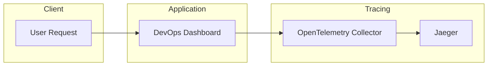

# Distributed Tracing Architecture

## Overview

Distributed tracing provides end-to-end visibility into application requests as they travel through the system.

The DevOps Dashboard is instrumented using OpenTelemetry. Trace data is collected by the OpenTelemetry Collector and exported to Jaeger for visualization and performance analysis.

---

# Tracing Architecture

---

# Components

## DevOps Dashboard

The application is instrumented using the OpenTelemetry SDK.

Responsibilities:

- Generate trace spans
- Propagate trace context
- Measure request latency
- Record application operations

---

## OpenTelemetry Collector

Responsibilities:

- Receive telemetry data
- Process trace information
- Batch trace exports
- Forward traces to Jaeger

Deployment Type:

- Kubernetes Deployment

---

## Jaeger

Responsibilities:

- Store trace data
- Visualize request flow
- Analyze latency
- Troubleshoot distributed systems

Features:

- Trace Search
- Span Timeline
- Dependency Analysis
- Performance Insights

---

# Trace Workflow

1. A user sends a request to the application.
2. The application creates a trace for the request.
3. Individual spans are generated for application operations.
4. Trace data is sent to the OpenTelemetry Collector.
5. The collector forwards traces to Jaeger.
6. Jaeger visualizes the complete request lifecycle.

---

# Benefits

- End-to-end request visibility
- Latency analysis
- Root cause identification
- Performance optimization
- Faster debugging
